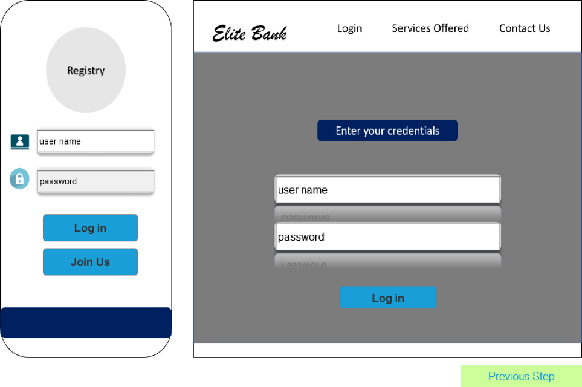

# Case Competition Prototype

### Installation Guide

First of all, after the files are downloaded, you need to find the file with a **Google Chrome sign and named *‘Home’***. All working prototypes are stored in html files.

If it is opened with the default browser, a page that prompts you to download the **Axure extension** may pop up (for Google Chrome). If that’s the case, just download the extension and allow the extension to perform certain functions (like check the URL) manually as articulated in the pop-up page.

After it is opened, the **home page** is shown. On the left hand side, a prototype that simulates the app for customer is shown. On the right hand side, that’s the **platform** for ‘Elite Bank’ (a make-up bank). The two log-ins, join us buttons will direct the window to three different directions. The first step should be to choose the ‘join us button’ and register for user1/2/3, if you don’t sign up and activate the account, you cannot log in.

One thing to note is the **back button** or the previous step button, it not only goes back the page, it also undoes what you change. For example, if you grant the approval to user 2 and go back (assume it is) to user 2 profile by ‘back button’, you cannot see any changes since the action is undone. Use ‘Home button’ or other navigation buttons instead.

###User Registration Procedures:

1. Click the ‘Join Us’ button and fill in the information. (User Name can be user1 or user2 or user3. Password has to be user. Other information blanks can be filled arbitrarily but all of them have to be filled out. Remember to click the Social Media row’s ‘Login and agree the terms’ as well.) Then click ‘Next Step’.
2. Click the camera icons until the green ticks are shown. Then click ‘Next Step’.
3. Click the fingerprint icon and facial recognition icon until the green ticks are shown. Then click ‘Submit’.
4. Click ‘Activate’ to finish registration and click ‘Go back to login page’.
5. Log in with the registered user name and password.

 

After logging in, you can see the profile and application status of the user.
Use the same method to register user2 and user3.

User1, User2, and User3 all are data instances that you create that has vastly different data attributes.

**User1** represents a customer who doesn’t have existing KYC ID (which is used for blockchain connection), and has been determined as low-risk. The user name is *‘user1’*, pw *‘user’*.
**User2** represents a customer who has existing KYC ID already, and is determined as high-risk upon account opening. The user name is *‘user2’*, pw *‘user’*.
**User3** represents a customer who is automatically rejected due to very low risk score from elite bank’s algorithm/ machine learning results. The user name is *‘user3’*, pw *‘user’*.
Other than that, **John Jones and Tracey Smith** are some pre-built database objects.
For bank platform, the user name and pw are both *‘admin’*.

#### Guidelines to the Bank Platform:

For Elite Bank’s Platform, use ‘admin’ for username and password to log in. After logging in, click the ‘Search Customer’ button to search existing customer in the system. You can’t search an account if it is not signed up and activated. 

  

Click ‘Mass Data Search’ and enter username. Click ‘Enter’ to see user’s account information.

Go back to the first page and click ‘KYC Approval’ to approve clients’ onboarding requests.

For Michael (user1), click ‘Yes’ in the ‘Proceed’ column. Then click ‘Approve’ in the window that pops out. Then Michael’s onboarding request will be approved and his information will be added into the blockchain network.

For Ivana (user2), click ‘Yes’ in the ‘Proceed’ column and click ‘Request for access of info’.

Go to Ivana’s (user2) profile page and click ‘Approve’. Ivana’s information will be shared to EB.

Click ‘Go to Bank Platform’ and click ‘Requested Approved, Proceed’ button. Click ‘Approve’ to approve Ivana’s onboarding request.

Ivana’s onboarding information will then be added to the blockchain network.

**Overall, the key of the working prototypes lies on the interactions between the app, banking database system and the bank platform. Every data and inputs or changes made from the app, or the bank’s platform will have changes on one another and also the database system. This is to simulate the real business environment and data communication across various departments.**

Should you expect to view all the changes, remember to register all of user1, user2 and user3.

#### A key grasp of the prototype:

1.	Digital ID is formed when the user enters it information, documents, and also biometrics. All the things are input into the database gathered as training data for clustering of machine learning. 
2.	Social media account entering is made available for easier retrieval of the customer data and a more accurate KYC checking.
3.	Relationship is studied with the help of block-chain network of digital id and also machine learning. For example, the relationship between Tracey Smith and User 2.
4.	Upon activation, database will be updated, and relevant people across all departments can share the information, cross-department communication is facilitated.
5.	Block-chain is leveraged so that anyone with existing ID and information stored in its identity can skip most if not all the KYC process. If they don’t have one yet, we will generate a chain code to help form one.
6.	An internal risk-scoring algorithm integrates all the information and give rating at the very beginning. Real time data record track is part of the information and this strengthen the risk preventing system. Also, time is saved when someone can be automatically rejected if it cannot pass the system.
7.	Note that there is phased on-boarding, the customer can get access to certain services before whole KYC process is done.
  

